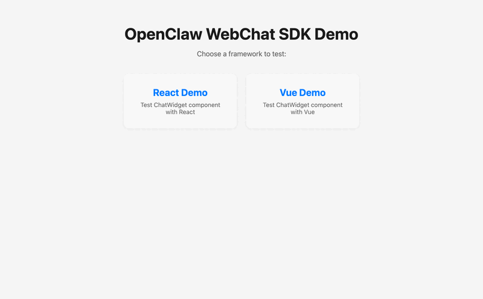

# OpenClaw WebChat SDK

[](https://www.npmjs.com/package/openclaw-webchat)
[](https://www.npmjs.com/package/openclaw-webchat)
[](https://github.com/raw34/openclaw-webchat/blob/main/LICENSE)
[](https://github.com/raw34/openclaw-webchat/actions/workflows/ci.yml)

[中文文档](./README.zh-CN.md)

Embeddable WebChat SDK for [OpenClaw](https://openclaw.ai) Gateway. Build custom AI chat interfaces for your applications.

## Demo



## Features

- **Ready-to-use Components** - Drop-in ChatWidget for React and Vue
- **Streaming Support** - Real-time AI response streaming
- **Customizable** - Hooks/Composables for building custom UI
- **Theming** - Light, dark, and auto theme modes
- **Flexible Positioning** - Floating or inline widget placement
- **Auto Reconnect** - Automatic reconnection on connection loss
- **TypeScript** - Full TypeScript support with type definitions
- **Lightweight** - Minimal dependencies, tree-shakeable

## Packages

| Package | Version | Description |
|---------|---------|-------------|
| [`openclaw-webchat`](./packages/core) | [](https://www.npmjs.com/package/openclaw-webchat) | Core WebSocket client (framework-agnostic) |
| [`openclaw-webchat-react`](./packages/react) | [](https://www.npmjs.com/package/openclaw-webchat-react) | React hooks and components |
| [`openclaw-webchat-vue`](./packages/vue) | [](https://www.npmjs.com/package/openclaw-webchat-vue) | Vue composables and components |

## Quick Start

### React

```bash
npm install openclaw-webchat-react
```

```tsx
import { ChatWidget } from 'openclaw-webchat-react';

function App() {
  return (
    <ChatWidget
      gateway="wss://ai.example.com:18789"
      token="your-token"
      position="bottom-right"
      theme="light"
      title="AI Assistant"
    />
  );
}
```

Or use the hook for custom UI:

```tsx
import { useOpenClawChat } from 'openclaw-webchat-react';

function CustomChat() {
  const { messages, isConnected, isLoading, streamingContent, send } = useOpenClawChat({
    gateway: 'wss://ai.example.com:18789',
    token: 'your-token',
  });

  return (
    <div>
      {messages.map((msg) => (
        <div key={msg.id}>
          {msg.role}: {msg.content}
        </div>
      ))}
      {isLoading && <div>AI is typing: {streamingContent}</div>}
      <input
        onKeyDown={(e) => {
          if (e.key === 'Enter') {
            send(e.currentTarget.value);
            e.currentTarget.value = '';
          }
        }}
        disabled={!isConnected}
      />
    </div>
  );
}
```

### Vue

```bash
npm install openclaw-webchat-vue
```

```vue
<script setup>
import { ChatWidget } from 'openclaw-webchat-vue';
import 'openclaw-webchat-vue/style.css';  // Required for styles
</script>

<template>
  <ChatWidget
    gateway="wss://ai.example.com:18789"
    token="your-token"
    position="bottom-right"
    theme="light"
    title="AI Assistant"
  />
</template>
```

Or use the composable for custom UI:

```vue
<script setup>
import { ref } from 'vue';
import { useOpenClawChat } from 'openclaw-webchat-vue';

const { messages, isConnected, isLoading, streamingContent, send } = useOpenClawChat({
  gateway: 'wss://ai.example.com:18789',
  token: 'your-token',
});

const input = ref('');

function handleSend() {
  if (input.value.trim()) {
    send(input.value);
    input.value = '';
  }
}
</script>

<template>
  <div>
    <div v-for="msg in messages" :key="msg.id">{{ msg.role }}: {{ msg.content }}</div>
    <div v-if="isLoading">AI is typing: {{ streamingContent }}</div>
    <input v-model="input" @keydown.enter="handleSend" :disabled="!isConnected" />
  </div>
</template>
```

### Core (Vanilla JS / Any Framework)

```bash
npm install openclaw-webchat
```

```typescript
import { OpenClawClient } from 'openclaw-webchat';

const client = new OpenClawClient({
  gateway: 'wss://ai.example.com:18789',
  token: 'your-token',
});

client.on('message', (msg) => {
  console.log('AI:', msg.content);
});

client.on('streamChunk', (id, chunk) => {
  process.stdout.write(chunk);
});

await client.connect();
await client.send('Hello, AI!');
```

## API Reference

### OpenClawClient Options

```typescript
interface OpenClawClientOptions {
  gateway: string;              // WebSocket URL
  token?: string;               // Auth token
  password?: string;            // Auth password (alternative)
  deviceToken?: string;         // Device token for persistent sessions
  deviceAuthProvider?: DeviceAuthProvider; // Optional browser device-auth override
  reconnect?: boolean;          // Auto-reconnect (default: true)
  reconnectInterval?: number;   // Reconnect interval in ms (default: 3000)
  maxReconnectAttempts?: number; // Max attempts (default: 10, -1 for infinite)
  connectionTimeout?: number;   // Timeout in ms (default: 10000)
  debug?: boolean;              // Debug logging (default: false)
}
```

### Client Methods

```typescript
// Connection
await client.connect();
client.disconnect();
await client.resetDeviceIdentity(); // Clear local device identity/token for current gateway
client.isConnected;           // boolean
client.connectionState;       // 'disconnected' | 'connecting' | 'connected' | ...

// Chat
await client.send(content);
const history = await client.getHistory(limit);
await client.inject(content, role);

// Events
client.on('connected', () => {});
client.on('disconnected', (reason) => {});
client.on('message', (msg) => {});
client.on('streamStart', (messageId) => {});
client.on('streamChunk', (messageId, chunk) => {});
client.on('streamEnd', (messageId) => {});
client.on('error', (error) => {});
```

## Troubleshooting

For gateway handshake debugging, use:

```bash
GATEWAY_AUTH_TOKEN=*** node scripts/diagnose-openclaw-ws.mjs --url wss://your-gateway/ws
```

- Use the `/ws` path (for example `wss://gateway.example/ws`).
- Failures are normalized to `category` and `code` (for example `PAIRING_REQUIRED`, `SCOPE_MISSING_WRITE`).
- In browser mode, OpenClaw device auth requires both IndexedDB and WebCrypto.
- If device identity is stale, call `client.resetDeviceIdentity()` and reconnect.

First pairing flow (WebChat/demo):
1. Connect from demo (or run diagnose script with default `device-auth=true`).
2. If response is `PAIRING_REQUIRED`, approve the pending device on gateway host.
3. Click `Retry Connection` in demo (manual retry by design).
4. If needed, click `Reset Device Identity`, then retry again.

## Development

```bash
# Install dependencies
pnpm install

# Build all packages
pnpm build

# Development mode
pnpm dev

# Run tests
pnpm test
```

## Contributing

Contributions are welcome! Please feel free to submit a Pull Request.

## License

[MIT](./LICENSE)
